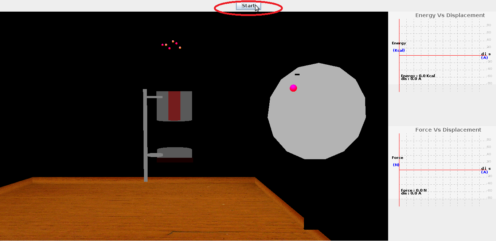
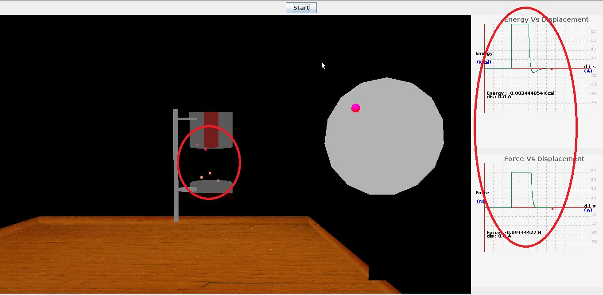

To perform this experiment there are certain parameters to be initialized and the procedure detailed here can be followed.

STEP1:Click on the start button, to start the experiment.  

Step2: The molecules pass through the column a plot of energy ,force acting on them during passage through column is seen on left side.  

  