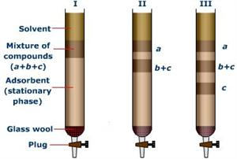

In column chromatography experiments, a long glass tube (as shown in the figure) is filled with a suitable material called the stationary-phase (also called as adsorbent). The mixture to be separated is dissolved in a suitable medium, which is called the mobile phase. When the mobile phase is passed through the column there is a three way equilibrium established between the sample, solvent and the adsorbent. Molecules in the mixture which interact strongly with stationary phase moves slowly through the column relatively to others that interact weakly with stationary phase. These weakly interacting molecules leave the column first and thus they can be separated out from the atoms that interact strongly with the stationary phase.  

